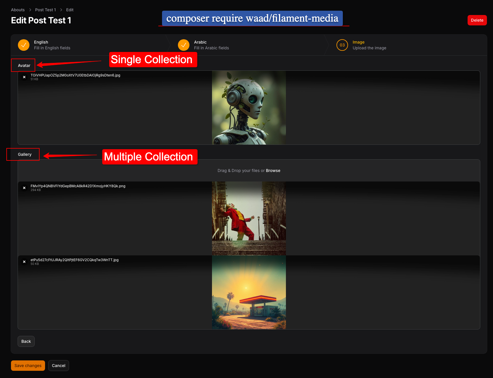

# Filament Media

This package provides a seamless integration between [Filament](https://filamentphp.com) v3/v4/v5 and the [waad/media](https://github.com/waadmawlood/media) manager package. It's Alternative to `spatie/laravel-medialibrary` It introduces a `MediaUpload` form component that dynamically builds itself based on your Eloquent Model's `registerCollections()` method.

## Requirements

- PHP: `^8.1`
- Filament: `^3.0 || ^4.0 || ^5.0`
- [waad/media](https://github.com/waadmawlood/media): `^4.1`

## Installation

You can install the package via composer:

```bash
composer require waad/filament-media
```

## Setup & Usage

Since this package works in tandem with `waad/media`, your Eloquent Models should use the `HasMedia` trait and implement `registerCollections`: [waad/media](https://github.com/waadmawlood/media) Package.

```bash
php artisan vendor:publish --provider="Waad\Media\MediaServiceProvider"
```

```php
use Illuminate\Database\Eloquent\Model;
use Waad\Media\HasMedia;

class Post extends Model
{
    use HasMedia;

    public function registerCollections(array $attributes = []): array
    {
        return [
            'avatar' => [
                'disk' => 's3',
                'bucket' => 'avatars',
                'label' => 'User Avatar',
                'single' => true, // Only keeps one file
            ],
            'gallery' => [
                'disk' => 'public',
                'bucket' => 'photos',
                'label' => 'Photo Gallery',
                'single' => false, // Allows multiple files
            ],
        ];
    }
}
```

Now, in your Filament Resource or Form, simply use `MediaUpload::make('collection_name')`:

```php
use Waad\FilamentMedia\Forms\Components\MediaUpload;

public static function form(Form $form): Form
{
    return $form
        ->schema([
            // This will automatically act as a single file upload because 'single' is true in registerCollections
            MediaUpload::make('avatar') // name collection,

            // This will automatically act as a multiple file upload because 'single' is false in registerCollections
            MediaUpload::make('gallery') // name collection
                ->collection('gallery')  // name collection
                ->reorderable()          // supports reordering of multiple files
                ->image()
                ->maxSize(2048),
            
            // It Select Multiple Files or Single File Automatically Based on `single` property in `registerCollections`
            // Can Use Other Methods of Filament `FileUpload` Component!
        ]);
}
```

The component automatically handles fetching current file URLs for previews and syncing modifications (adding and deleting) directly supplied by `waad/media`.

## Reordering multiple files (`index`)

For collections with `'single' => false`, you can enable drag-and-drop reordering with Filament’s `reorderable()` (same as `FileUpload`). Order is stored in waad/media’s **`index`** column on the `media` table.

- **Loading the form:** existing files are listed sorted by `index`, then by id, so the UI matches the saved order.
- **Saving the form:** when only existing media are present (no new uploads in that save), the component writes the current list order back to the database as `index` values (`1`, `2`, `3`, …) for that collection.

```php
MediaUpload::make('gallery')
    ->reorderable()
    ->image(),
```

Use this together with a multi-file collection in `registerCollections()`. Single-file collections ignore ordering.

## Preview images in tables

In list/table views, use Filament’s `ImageColumn` and resolve URLs from your model with [waad/media](https://github.com/waadmawlood/media)’s `getCollectionUrls()` (provided by `HasMedia`). Pass the same collection name you use in `registerCollections()` and in `MediaUpload::make(...)`.

```php
use Filament\Tables\Columns\ImageColumn;

ImageColumn::make('banner')
    ->getStateUsing(fn (Post $record) => $record->getCollectionUrls('banner')),
```

- For a **single-file** collection (`'single' => true`), `getCollectionUrls` typically returns one URL string (or an empty value when there is no file).
- For a **multi-file** collection, it returns an array of URLs; `ImageColumn` can show them as a stacked preview when the state is an array.

Adjust the column name (`banner` here) to match your collection key.

## Pruning old media

[waad/media](https://github.com/waadmawlood/media) registers the `media:prune` Artisan command. It removes media files and database rows according to the retention setting `prune_media_after_day` in your published `config/media.php` (see the waad/media docs for details).

Run it manually or on a schedule (for example Laravel’s scheduler in `routes/console.php`):

```bash
php artisan media:prune
```

## Testing

This package uses Pest for testing. To run tests:

```bash
composer test
```

## License

This package is open-sourced software licensed under the [MIT license](https://opensource.org/licenses/MIT).
